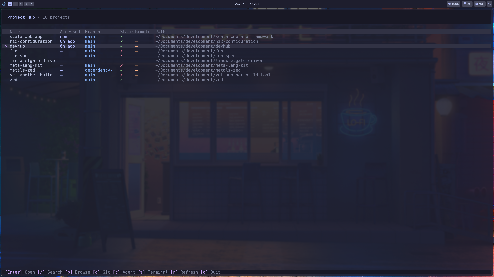

# DevHub

A terminal UI project manager with git integration, built with Bun, SolidJS, and [@opentui/solid](https://github.com/anomalyco/opentui).

## Features

- **Project List** - View all your projects sorted by last accessed time
- **Git Status** - See branch, working tree state (clean/dirty), and remote sync status
- **Quick Search** - Filter projects by name or path
- **File Explorer** - Browse directories to add new projects
- **Editor Integration** - Open projects in your `$EDITOR`
- **Lazygit Integration** - Quick access to git operations
- **Coding Agent Integration** - Launch AI coding agents (Claude Code, Codex, etc.) in project directories



## Installation

### From Source

```bash
git clone <repo-url>
cd devhub
bun install
bun compile

sudo cp dist/devhub /usr/local/bin/
```

### Development

```bash
bun install
bun dev
```

### Using Nix Flake

```bash
nix run github:Tammo0987/devhub   # try it
nix shell github:Tammo0987/devhub # or add to shell
```

Add to your flake inputs:

```nix
inputs.devhub.url = "github:Tammo0987/devhub";
```

Then add `devhub.packages.${pkgs.system}.default` to `environment.systemPackages` (NixOS) or `home.packages` (Home Manager).

### Using devenv

This project includes a [devenv](https://devenv.sh) configuration that sets up all required dependencies.

With direnv:

```bash
direnv allow
```

Without direnv:

```bash
devenv shell
```

## Usage

### TUI Mode

```bash
devhub
```

### CLI Commands

```bash
devhub add <path>    # Add all git repos inside a directory
devhub list          # List all projects
devhub remove <id>   # Remove a project by ID or name
devhub help          # Show help
```

## Keybindings

| Key                    | Action                              |
| ---------------------- | ----------------------------------- |
| `j` / `k` or `↑` / `↓` | Navigate list                       |
| `Enter`                | Open project in `$EDITOR`           |
| `/`                    | Search/filter projects              |
| `a`                    | Add projects (opens file explorer)  |
| `d`                    | Delete project                      |
| `g`                    | Open lazygit                        |
| `c`                    | Open coding agent (`$DEVHUB_AGENT`) |
| `r`                    | Refresh git status                  |
| `q`                    | Quit                                |

### File Explorer (Add Mode)

| Key                    | Action                 |
| ---------------------- | ---------------------- |
| `j` / `k` or `↑` / `↓` | Navigate               |
| `l` / `→`              | Enter directory        |
| `h` / `←`              | Go to parent           |
| `Enter`                | Add current directory  |
| `Shift+Enter`          | Add all subdirectories |
| `Esc`                  | Cancel                 |

### Delete Confirmation

| Key       | Action                 |
| --------- | ---------------------- |
| `y`       | Remove from list only  |
| `Shift+D` | Delete files from disk |
| `Esc`     | Cancel                 |

## Configuration

Projects are stored at `~/.config/devhub/projects.json`.

### Environment Variables

| Variable       | Description                                             |
| -------------- | ------------------------------------------------------- |
| `EDITOR`       | Editor to open projects with (required for `Enter` key) |
| `DEVHUB_AGENT` | Coding agent command (e.g., `claude` or `codex`)        |

## Tech Stack

- **Runtime**: [Bun](https://bun.sh)
- **Language**: TypeScript
- **TUI Framework**: [@opentui/solid](https://github.com/anomalyco/opentui)
- **UI Library**: [SolidJS](https://solidjs.com)
- **Git**: [simple-git](https://github.com/steveukx/git-js)
- **Theme**: [Catppuccin Mocha](https://github.com/catppuccin/catppuccin)
